# Navlyn 官网原型设计说明

## 1. 项目目标

Navlyn 官网需要同时承担 4 个角色：

- 品牌官网：建立“低空经济 + 人工智能”的品牌认知。
- 产品官网：展示 `ARC OS`、硬件产品与行业解决方案。
- 销售转化页：引导用户预约演示、提交需求、联系销售。
- 国际合作入口：支撑海外客户、代理商、合作伙伴理解公司能力。

核心转化目标建议按优先级排序如下：

1. 预约演示 / 商务咨询
2. 获取产品资料 / 下载手册
3. 申请合作伙伴或代理商联系
4. 建立品牌信任并沉淀行业影响力

## 1.1 本次设计原则

由于当前素材和时间有限，首版原型不做“大而全”的官网，而是遵循 3 个原则：

- 先做核心页面：优先保证首页、产品、ARC OS、关于我们可上线。
- 先做清晰表达：用有限资料把品牌定位、产品体系和联系转化讲清楚。
- 先做轻量实现：页面模块控制在 `6` 到 `8` 个，方便用 `React + Vite + TypeScript + Ant Design` 快速落地。

首发版本建议压缩为 5 个一级导航：

- Home
- Products
- ARC OS
- Industries
- About Us

其余内容先并入对应页面：

- `Resources` 先并入 `About Us` 和 `Products`
- `Customers` 先并入 `About Us`
- 多语言先只做 `中文 / English`

## 2. 站点结构

```mermaid
flowchart TD
    A["Navlyn 官网"] --> B["Home 首页"]
    A --> C["Products 产品中心"]
    A --> D["ARC Engine / ARC OS"]
    A --> E["Industries 行业应用"]
    A --> F["Resources 资源中心"]
    A --> G["Customers 客户与合作"]
    A --> H["About Us 关于我们"]
    A --> I["Language 多语言"]

    C --> C1["Hardware 硬件产品"]
    C --> C2["Software 软件系统"]

    D --> D1["ARC Academy 学习与课程"]
    D --> D2["Simulation Lab 飞行模拟训练"]
    D --> D3["Data Hub 数据案例库"]
    D --> D4["Model Updates 模型更新"]

    E --> E1["Surveying & Mapping 测绘"]
    E --> E2["Construction & Engineering 建筑和能源"]
    E --> E3["Mining & Resources 矿业"]
    E --> E4["Environmental & Forestry 山林巡检"]
    E --> E5["Road & Railway 公路铁路"]

    F --> F1["Articles 深度文章"]
    F --> F2["Success Stories 成功案例"]
    F --> F3["Webinars & Events 活动预告 / 回放"]
    F --> F4["Downloads 下载中心"]
    F --> F5["FAQ / Help Center 帮助中心"]

    G --> G1["Partners 合作伙伴"]
    G --> G2["Global Resellers 全球经销商"]

    H --> H1["Company Story / Vision 公司愿景"]
    H --> H2["Press & News 新闻动态"]
    H --> H3["Careers 招聘"]
```



## 3. 导航设计建议

考虑到资料有限，顶部导航建议首版保留 5 个一级入口：

- Home
- Products
- ARC OS
- Industries
- About Us

右侧固定功能：

- `预约演示` 主按钮
- `EN / 中文` 语言切换

移动端导航建议使用全屏抽屉，并在顶部直接露出：

- 预约演示
- 联系销售
- 下载手册

## 4. 首页原型

首页目标不是堆信息，而是用 1 页讲清楚三件事：

1. Navlyn 是谁
2. 为什么技术路线不同
3. 为什么值得客户进一步联系

### 4.1 首屏 Hero

目的：3 秒内传递品牌气质和核心定位。

建议结构：

- 背景：无人机/空域协同视频或动态视觉
- 主标题：开启飞行智能体时代
- 副标题：低空经济 + 人工智能
- 价值主张：去飞手化 | 安全可控 | 群体协同
- CTA 1：预约产品演示
- CTA 2：查看产品体系
- 辅助信息：全球布局 / 中法联合团队 / ARC OS

线框示意：

```text
+--------------------------------------------------------------+
| Logo   Home Products ARC OS Industries Resources About  EN  |
|                                                              |
| 开启飞行智能体时代                                             |
| 低空经济 + 人工智能                                            |
| 去飞手化 | 安全可控 | 群体协同                                  |
| [预约产品演示]  [查看产品体系]                                  |
|                                                              |
|               视频 / 动态飞行场景视觉                           |
+--------------------------------------------------------------+
```

### 4.2 品牌能力总览

目的：快速解释“Navlyn 的优势”。

建议用 4 张能力卡片：

- 自主引擎研发
- 软硬件一体化
- 全场景行业适配
- 全生命周期服务

每张卡片包含：

- 一句标题
- 一段 40 到 60 字说明
- 一张对应配图或图标

### 4.3 产品体系

目的：让用户立即理解 Navlyn 不是单一无人机品牌，而是“系统 + 终端 + 场景方案”的组合。

建议分成左右结构：

- 左侧：`ARC OS` 的操作系统定位
- 右侧：硬件产品矩阵

展示逻辑：

- 软件中枢：ARC OS / 多模态交互 / 权限治理 / 协同调度
- 飞行终端：Commander X1、Scout S1、无人船与扩展设备
- 结果交付：测绘、巡检、搜救、治理、建模

### 4.4 ARC OS 专题模块

目的：把“去飞手化、安全可控、群体协同”讲透。

建议拆成 3 个并列模块：

- A: 去飞手化
  - 从执行指令升级为理解意图、自动规划、自动执行
- R: 安全可控
  - 权限体系、策略引擎、日志审计、责任追溯
- C: 群体协同
  - 多机多域统一编排，持续演进

建议增加一句解释性文案：

`不是卖单台设备，而是交付可长期运行的系统能力。`

### 4.5 行业应用

目的：让潜在客户快速找到自己的场景。

首版建议只保留 4 个高相关场景，避免页面过长：

- 测绘
- 建筑与工程
- 矿业与资源
- 应急救援

每个行业卡片建议展示：

- 典型任务
- 使用产品
- 可交付结果
- 成功案例入口

### 4.6 成功案例

建议优先展示有国际化辨识度和强结果感的案例：

- 马达加斯加智慧矿区
- 多哥港口海空一体巡检
- 南湖救援演示

每张案例卡包含：

- 地区 / 客户类型
- 核心挑战
- 方案组合
- 结果数字

### 4.7 全球合作与团队背书

目的：建立信任。

建议组合展示：

- 高校 / 实验室合作
- 国际团队照片
- 专家观点
- 海外市场分布

### 4.8 最终转化区

建议在首页底部放置高转化区块：

- 标题：体验我们的产品与解决方案
- 说明：预约演示、免费试用、方案咨询
- 表单字段：姓名 / 公司 / 职位 / 手机 / 邮箱 / 需求场景
- CTA：立即预约

## 5. 二级页面原型建议

## 5.1 Products

目标：形成产品型官网的完整购买认知。

首版页面结构建议：

1. 产品总览 Banner
2. 软件与硬件双分区
3. 单产品列表卡片
4. 应用场景映射
5. 下载手册 / 联系销售

单产品详情页建议包含：

- 产品定位
- 核心能力
- 参数规格
- 作业流程
- 适配行业
- 常见问题
- 预约演示

## 5.2 ARC OS

目标：突出技术壁垒和差异化。

首版页面结构建议：

1. ARC OS 定位
2. A / R / C 三大价值拆解
3. 权限治理与安全架构
4. 群体协同任务编排
5. 典型应用场景
6. Demo 预约

## 5.3 Industries

目标：让每个行业客户看到“这就是给我做的”。

首版建议不拆太多单页，先做一个总览页 + 4 个场景卡片。

如果后续单独拆页，可使用统一模板：

1. 行业痛点
2. Navlyn 方案
3. 推荐产品组合
4. 交付内容
5. 实际案例
6. 联系顾问

## 5.4 About Us

目标：补足品牌故事、团队、新闻与招聘。

建议包含：

- 公司故事与愿景
- 核心团队
- 产学研合作
- 新闻动态
- 联系方式 / 合作入口

## 6. 视觉与交互建议

结合现有资料，视觉方向建议如下：

- 主色：深海军蓝 + 科技蓝光 + 黑色背景
- 辅色：银灰、浅蓝、少量高亮青色
- 关键词：冷静、未来、可信、国际化
- 视觉语言：视频开场、数据线框、空间感渐变、硬件大图

考虑到采用 `Ant Design`，交互建议更偏稳健和专业：

- 首屏视频静音自动播放
- 卡片 hover 仅做轻微位移和阴影变化
- 行业卡片使用 Tabs 或 Segmented 切换
- 产品信息使用 Collapse / Tabs / Card 组织
- 表单使用 Ant Design `Form`，减少自定义复杂交互

## 7. 组件落地建议

为了提高开发效率，页面尽量用 Ant Design 现成组件组合：

- 头部导航：`Layout.Header` + `Menu` + `Button`
- 首页卡片区：`Row` + `Col` + `Card`
- 行业应用：`Tabs` 或 `Segmented`
- 产品参数：`Descriptions` 或 `Table`
- 新闻与动态：`List`
- 联系表单：`Form` + `Input` + `Select` + `Button`
- 页脚：`Layout.Footer`

## 8. 低保真原型交付建议

如果下一步进入 Figma，建议优先画这 4 个页面：

1. 首页
2. Products 列表页
3. ARC OS 专题页
4. About Us / 联系页

## 9. 当前仍需补充的信息

基于现有资料，已经足够出第一版原型，但正式上线前还需要补齐：

- 公司对外联系信息
- 表单提交后的承接方式
- 新闻列表的正式发布时间与链接
- 产品参数的最终版口径
- 合作伙伴与客户 logo 授权情况
- 多语言优先级

## 10. 建议的下一步

建议按这个顺序推进：

1. 先确认首页与一级导航结构
2. 再补全 Products / ARC OS / Industries 三个核心页面
3. 最后补 About Us、新闻和双语内容
